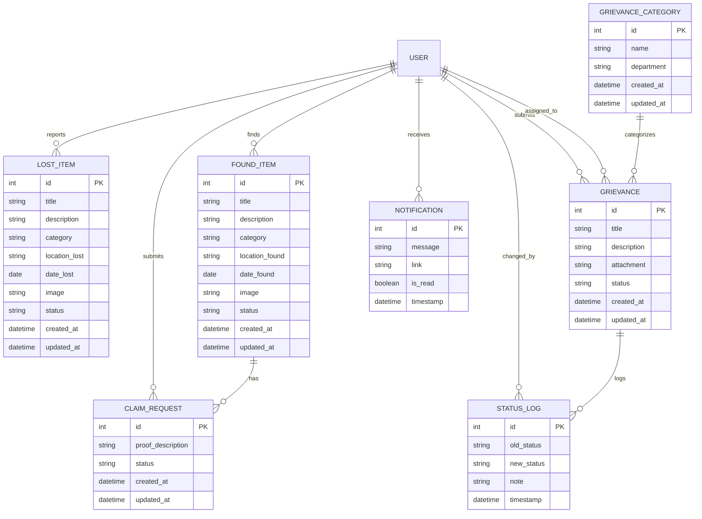

# Entity Relationship Diagram

This document details the database schema design and relations between components.

```mermaid
erDiagram
    USER ||--o{ LOST_ITEM : "reports"
    USER ||--o{ FOUND_ITEM : "finds"
    USER ||--o{ CLAIM_REQUEST : "submits"
    USER ||--o{ GRIEVANCE : "submits"
    USER ||--o{ GRIEVANCE : "assigned_to"
    USER ||--o{ NOTIFICATION : "receives"
    USER ||--o{ STATUS_LOG : "changed_by"

    LOST_ITEM {
        int id PK
        string title
        string description
        string category
        string location_lost
        date date_lost
        string image
        string status
        datetime created_at
        datetime updated_at
    }

    FOUND_ITEM {
        int id PK
        string title
        string description
        string category
        string location_found
        date date_found
        string image
        string status
        datetime created_at
        datetime updated_at
    }

    CLAIM_REQUEST {
        int id PK
        string proof_description
        string status
        datetime created_at
        datetime updated_at
    }

    GRIEVANCE_CATEGORY {
        int id PK
        string name
        string department
        datetime created_at
        datetime updated_at
    }

    GRIEVANCE {
        int id PK
        string title
        string description
        string attachment
        string status
        datetime created_at
        datetime updated_at
    }

    STATUS_LOG {
        int id PK
        string old_status
        string new_status
        string note
        datetime timestamp
    }

    NOTIFICATION {
        int id PK
        string message
        string link
        boolean is_read
        datetime timestamp
    }

    FOUND_ITEM ||--o{ CLAIM_REQUEST : "has"
    GRIEVANCE_CATEGORY ||--o{ GRIEVANCE : "categorizes"
    GRIEVANCE ||--o{ STATUS_LOG : "logs"
```
